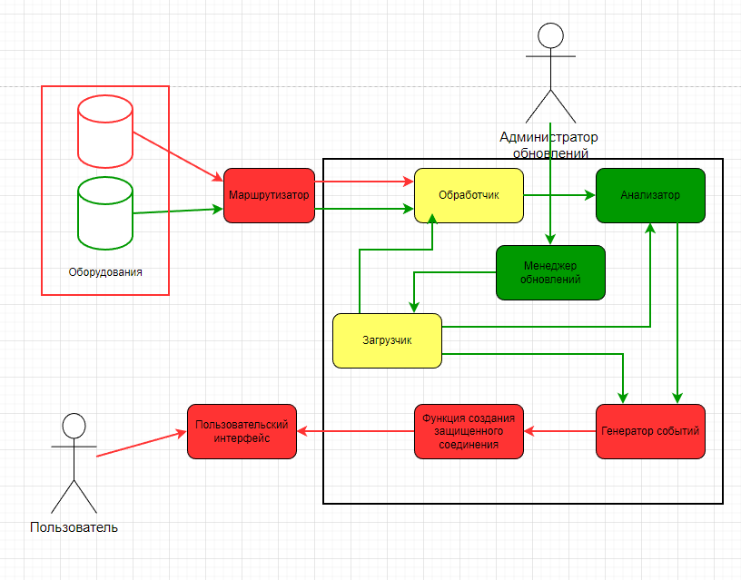

# Название продукта / решения

Проектирование кибериммунного устройства мониторинга оборудования (КУМО)

## Краткое описание назначения и применения продукта

КУМО получает данные от промышленного оборудования из внутренней сети, обрабатывает эти данные, в
случае превышения пороговых значений генерирует события, которые пользователь из внешней сети может
получить для дальнейшего анализа. Должна быть возможность осуществить безопасное обновление КУМО
(полное или частичное).
Предполагается использовать КУМО в т.ч. на заводе по производству лекарств.

## Ценности продукта и непримемлемые события в их отношении

| Ценность      | Непримемлемые события | Комментарий  |
| ------------- |:-------------:| -----:|
| Данные от промышленного оборудования      | утеря данных |  |
| Интерфейс для оборорудования      | прерывание соединения, полное отсутствие соедиения |  |
| Обработчик полученных данных      | некорректная обработка, некорректная передача обработанных данных |  |
| Анализатор обработанных данных      | ложно-положительные срабатывания |  |
| Функция удаленного доступа      | неавторизованный доступ, потеря соединения |  |
| Генератор событий     | некорректная передача |  |
| Сгенерированные события       | несанкционированный доступ, утечка данных |  |
| Функция обновления ПО устройства     | прерывание во время работы, некорректная установка обновления |  |
| Файлы обновления ПО      | модификация злоумышленником |  |
| Пользовательский интерфейс    | неавторизованный доступ |  |
| Менеджер обновлений    | некорректная сравнение файлов |  |
| Загрузчик    | некорректная загрузка, неполная загрузка, загрузка файлов с вредоносной нагрузкой |  |

## Верхнеуровневые сценарии (режимы) работы продукта

Загрузка обновления 

## Роли пользователей

| Роль | Описание | Комментарий  |
| ------------- |:-------------:| -----:|
| Пользователь      | принимает данные через интерфейс | должен пройти аутификацию |
| Администратор обновлений      | загрузка файлов обновления | должен пройти аутификацию |
| Администратор       | контролирует корректность работы устройства | должен пройти аутификацию |

## Контекст работы системы

- Устройство располагается в локальной сети отдельно от заводского оборудования
- Подключено к маршрутизатору, по которому принимает данные от оборудования
- Оборудования, подключенные к устройству, сверяются со списком разрешеных устройств
- На выходе отправляет (в случае обнаружения превышения пороговых значений) события пользователю, находящемуся во внешней сети
- Админитсратор обновлений пересылает файл обновлений из локальной сети
- Администратор обновлений должен быть авторизован в системе 
- Администратору обновлений запрещено проводить прочие операции над устройством
- Для получения событий пользователь должен быть авторизован
- Данные с обородования поступают на выделенный для них интерфейс

## Цели и предположения безопасности

### Цели

1. Только аутентичные и авторизованные пользователи получают события сгенерированные системой
2. Обрабатываются данные, полученные только с оборудования, внесенного в список разрешенных

### Предположения

1. Файлы обновлений не содержат зловредной нагрузки
2. Каналы передачи данных с оборудований защищены

## Ключевые сценарии

### Негативные сценарии

Сценарий 1: получение данных с недостоверного источника

 
 
 Сценарий 2: получение событий неавторизованным пользователем

 

## Политика архитектуры системы

